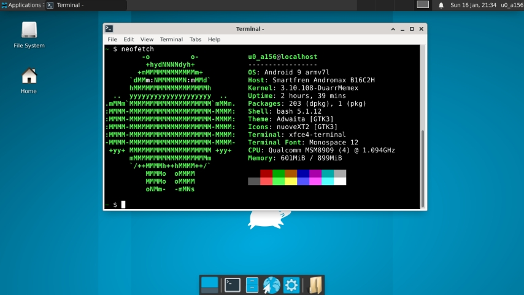

# GTerm-Desk
Is a script to install the xfce4 desktop environment for termux using the x11 repository.

## Install
```
pkg install git
git clone https://github.com/NatsukaRyuuou/Gterm-Desk
cd GTerm-Desk
./install
```

## ScreenShoot

